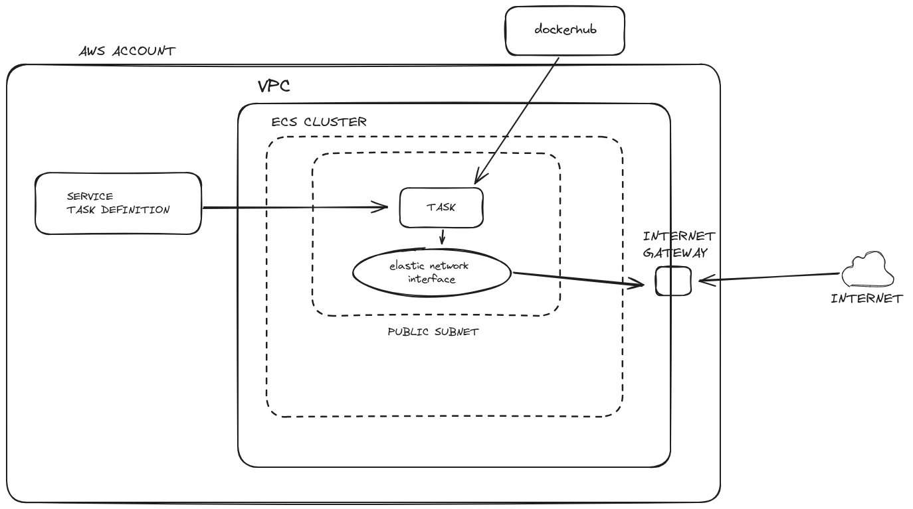

## DESCRIPTION
The goal of this project is to create and deploy a simple container on aws cloud, that says "hello world!" on port 3000. \
The technology used is ECS FARGATE.

## ARCHITECTURE

## DEPLOYMENT
In order to deploy this architecture run the cloudformation stack (template.yaml) on your account specifying the vpc and the **public** subnet id in which you want your service to be deployed on. \
After the cloudformation stack is correctly created search on the ecs service the task created and the public ip assigned to it. Call that public ip on port 3000 and voilà you have your "hello world!".